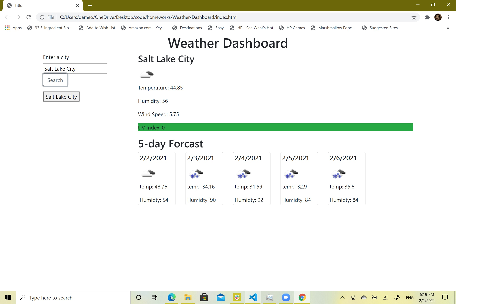

# Weather-Dashboard

I want to diplay weather for multiple cities to the user so that the user can plan a trip.

- I want the user to be able to search for a city
- Then I want to display the weather for the current weather conditions
- I want to display the temperature, the humidity, the wind speed, and the UV index
- I want to use color to indicates if the UV index is favorable, moderate, or severe
- I want to show the five day forecast of the city that the user search
  Project website: https://dad1977ut.github.io/Weather-Dashboard/
  
